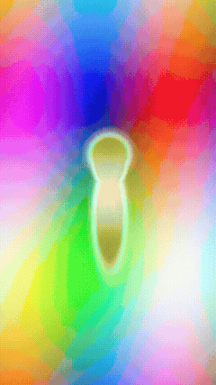

# Viral Video Edit Skills

Claude / Codex-compatible **skills** for making beat-perfect, effect-integrated short-form music video edits — the kind of dense, audio-reactive vertical edits used to promote songs on TikTok/Reels/Shorts.

These were extracted from a working production system and its accumulated field feedback: what actually made edits perform, what got rejected and why, and the exact technical recipes (librosa cut grids, matte-anchored FX, procedural GLSL renderers, grade formulas, hook-writing rules, footage QA gates) behind them.

## What's included

- **`skills/viral-video-edits/`** — the master skill. Start here. A compact `SKILL.md` with 10 non-negotiable "Laws" and a workflow, backed by 8 reference docs carrying every load-bearing constant:
  - `song-analysis.md` — beat/energy/section analysis, viral-window scoring, the onset-locked cut grid, envelope followers
  - `integrated-fx.md` — the core craft rule (effects fused into shots, never cutaway), the person-matte pipeline, three build architectures, compositing gotchas
  - `procedural-renderers.md` — headless moderngl/GLSL rendering (tunnels, portals, kaleidoscopes), the "near-black + emissive" art-direction law, footage/FX fusion
  - `cinematic-grade.md` — the exact filmic grade recipe, camera language, and iteration case studies
  - `hooks-and-text.md` — the 5-test hook QA gate, text kinetics, the adversarial-tournament method for creative decisions
  - `footage-sourcing.md` — vibe specs, source tiers, the shot-level quality gate, licensing
  - `delivery-qa.md` — encode settings, QA pass, verdict format
  - `design-docs.md` — how to plan a production before building it

  Plus `scripts/` — working, run-as-is implementations of the core engines, not just descriptions of them:
  - `scripts/procedural/` — 10 standalone audio-reactive GLSL renderers (moderngl): a raymarched ember tunnel, a log-polar kaleidoscope mandala, an infinite-zoom starburst, a glass-bloom kaleidoscope, a Mandelbox tunnel flythrough, a kaleidoscopic IFS fractal, a six-look sampler pack, a footage↔tunnel fusion shader, plus `footage_fx.py` (whole-frame FX on real clips) and `subject_fx.py` (matte-anchored FX on a person). Every renderer reads a real song's onset envelope and reacts to it — punch-zooms, flashes, and speed all ride the beat.
  - `scripts/matte/` — `generate_local_person_matte.swift` (per-frame person matting via Apple's on-device Vision framework — compile once, run on any clip) and `media_contract.py` (the matte quality-gate thresholds as executable code).
  - `scripts/build_onset_cut.py` — the onset-locked v2 cutter: cuts on every real transient in a song, holding when sparse and bursting when busy, instead of a fixed density preset.
  - `scripts/scan_shot_quality.py` — the shot-level footage quality gate (luma/sharpness/text/border/colorfulness/motion) that decides which footage is even allowed into an edit.
  - `scripts/choose_viral_window.py` — picks the best 15-30s window of a song by chorus repetition, energy build, loop seam, and lyric placement.

- **`skills/song-edit-analysis/`**, **`skills/beat-synced-montage-builder/`**, **`skills/generated-media-sourcing/`**, **`skills/edit-delivery-qa/`** — a companion kit of narrower, script-bundled skills covering the same pipeline stage by stage, each with its own runnable Python script (full song analysis, source scanning, QA probing).

## Workflows — see it in action

**[WORKFLOWS.md](WORKFLOWS.md)** walks through 6 concrete workflows with runnable commands and a real rendered GIF under each one — from a footage-free audio visualizer, to fusing real footage with a shader in one pass, to a full onset-locked multi-clip montage. Every GIF was rendered directly from this repo's scripts against a synthetic, non-copyrighted test beat and synthetic test clips bundled in `demo/` — nothing shown is a mockup, and you can reproduce every one of them yourself.

One example — tracking a person and applying an effect to ONLY them while the background stays untouched (`subject_fx.py`'s `subject_kaleido` mode):

See [WORKFLOWS.md](WORKFLOWS.md) for this and the other 5 workflows (pure visualizer, beat-reactive footage FX, footage+tunnel shader fusion, onset-locked montage cutting, viral-window analysis).

## Using these skills

### Claude Code / Claude (skills)

Copy (or symlink) the `skills/` directory you want into your project's `.claude/skills/`, or install the whole folder as your skills directory. Claude will pick up `viral-video-edits` automatically for edit-related requests, or you can invoke it explicitly.

### Codex / other agents

Each skill's `SKILL.md` is plain instructions — point any coding agent at the file and ask it to follow it. The bundled `agents/openai.yaml` files (where present) give a display name and default prompt for Codex-style skill registries.

## Requirements for the bundled scripts

The scripts under `skills/*/scripts/` expect `ffmpeg`/`ffprobe` on `PATH` and a Python environment with `librosa`, `numpy`, `scipy`, `pandas`, `scikit-learn`, `matplotlib`, and `soundfile`. The deeper techniques described in `viral-video-edits` (procedural GLSL rendering, Apple Vision person mattes) additionally need `moderngl` and, for the matte pipeline, macOS 14+ with Swift/Vision/AVFoundation.

## License

MIT — see `LICENSE`. Bring your own music and footage; nothing here includes or requires any copyrighted or private media.
