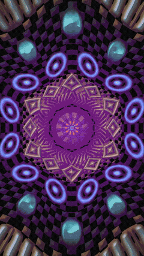
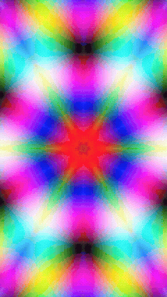
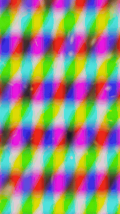
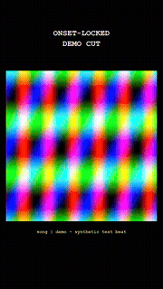

# Workflows

Every GIF on this page is a **real, unedited render** from the scripts in this repo — not a mockup. They were produced by `demo/make_demo_assets.py`, which synthesizes:

- a percussive test-beat WAV (kick + hat pattern, pure math, no sampled or copyrighted audio) — bundled at `demo/test_beat.wav`
- a few short animated color-pattern clips (moving sine-wave plasma fields) standing in for "footage"
- one clip with a simple synthetic head+torso blob standing in for "a person," plus its matching per-frame matte

No real people, no licensed clips, no copyrighted music anywhere in this repo — which also means you can run every command below yourself, verbatim, right now, on the bundled `demo/test_beat.wav`, and get the same kind of output. Swap in your own song and footage for real use.

All commands assume you're in `skills/viral-video-edits/scripts/` and using the demo assets at `../../../demo/`. Adjust paths as needed.

---

## 1. Pure visualizer — no footage at all

9 of the 10 procedural renderers need nothing but an audio file. They generate the entire image from math (raymarched tunnels, kaleidoscope folds, fractals) and react to that audio's onset envelope.

```bash
python3 procedural/render_hyper_kaleido.py \
  --audio ../../../demo/test_beat.wav --start 0 --dur 5 \
  --out kaleido_demo.mp4 --w 540 --h 960
```



Swap the script name for any other `procedural/render_*.py` (color_tunnel, glass_bloom, mandala, fractal_neon, neon_cathedral, dream_portal, hyper_space_jump, shader_pack) to get a different look — same calling convention for all of them.

---

## 2. Beat-reactive treatment on your own footage

`footage_fx.py` warps a real clip through 5 audio-reactive looks (kaleido fold, echo trails, time ripple, prism glitch, halftone). No matte, no person needed — it treats the whole frame.

```bash
python3 procedural/footage_fx.py \
  --src your_clip.mp4 --audio your_song.mp3 --start 30.0 \
  --out fx_sampler/
```



This renders all 5 looks back-to-back as a labeled sampler reel so you can pick the winner. (The GIF above shows just the `beat_kaleido` look, isolated for this demo.)

---

## 3. Kaleidoscope the PERSON, leave the world normal

This is the one to reach for when you want an effect locked to a subject while everything around them stays untouched — the textbook "integrated FX" case (see `references/integrated-fx.md`). Two steps:

**Step 1 — track the person.** `generate_local_person_matte.swift` uses Apple's on-device Vision framework to output a per-frame grayscale mask, white where the person is. Compile once, run on any clip:

```bash
swiftc matte/generate_local_person_matte.swift -O \
  -framework AVFoundation -framework Vision -framework CoreImage -framework ImageIO \
  -o mattegen
./mattegen your_clip.mp4 mattes/
```

**Step 2 — apply the effect through the matte.** `subject_fx.py` ships a `subject_kaleido` mode: the person folds into a kaleidoscope of their OWN pixels; the background is copied through unchanged, pixel for pixel.

```bash
python3 procedural/subject_fx.py \
  --segment your_clip.mp4 --mattes mattes/ --audio your_song.mp3 --start 10.0 \
  --out subject_fx_out/
```


Notice the boundary: outside the glowing rim, the background is pixel-identical to the source — it's genuinely unmodified, not just visually similar. `subject_fx.py` also ships 5 other matte-anchored looks (`world_ripple`, `echo_clones`, `neon_rim`, `bg_kaleido`, `subject_prism`) — see the module docstring. By default the script renders all 6 as a labeled sampler; for a single look in production, pin `uMode` to that look's fixed index in your own render loop (see the docstring — reordering the `MODES` list will NOT work, since the shader branches are keyed to fixed positions).

---

## 4. Footage fused with a procedural world (one shader pass)

`render_portal_weave.py` decodes a real clip into the SAME fragment shader that raymarches the ember tunnel — footage and effect share one palette, one tonemap, one particle field. Not a composite of two renders; genuinely one pass.

```bash
python3 procedural/render_portal_weave.py \
  --base your_basecut.mp4 --audio your_song.mp3 --start 60.0 --dur 15 \
  --cuts "2.1,4.3,6.8" --phi rush \
  --out fused.mp4
```



`--cuts` should be the exact cut boundary times of your base edit, so each cut lands as an in-shader zoom/chromatic-split punch instead of a hard visual seam. `--phi` picks how much the tunnel swallows the frame over time (`ramp` steady, `breath` energy-following, `rush` hot start).

---

## 5. Straight multi-clip montage cut to the beat (no shaders)

`build_onset_cut.py` is a pure editing tool — no procedural rendering at all. It cuts a pool of real clips on every onset in the song (holding when the song is sparse, bursting when it's busy), rotating sources so the same clip doesn't repeat back-to-back.

```bash
python3 scan_shot_quality.py --root your_footage/           # gates clips into shot_map.json
python3 build_onset_cut.py --config job.json --shot-map your_footage/shot_map.json
```

Where `job.json` looks like:

```json
{
  "slug": "my_edit",
  "audio": "your_song.mp3",
  "window": [30.0, 45.0],
  "hook_lines": ["first line", "second line"],
  "title": "song title",
  "artist": "artist name",
  "footage_files": ["clip1.mp4", "clip2.mp4", "clip3.mp4", "clip4.mp4"],
  "out_dir": "outputs/my_edit"
}
```



The GIF above is 4 synthetic test clips cut against 6 seconds of the demo beat — 26 cuts, averaging 0.23s each, entirely onset-driven (no fixed density preset). The black canvas + centered footage window + monospace hook text is the house container format (see `references/hooks-and-text.md`).

---

## 6. Analysis only — no video output

`choose_viral_window.py` doesn't render anything; it scores candidate windows of a song and writes JSON/CSV so you know WHERE to point any of the workflows above.

```bash
python3 choose_viral_window.py --audio your_song.mp3 --durations 15,22,30 --out windows/
```

Example output (one scored window):

```json
{
  "start_sec": 81.92, "end_sec": 103.92, "duration": 22, "score": 0.7341,
  "energy": 0.81, "repetition": 0.74, "energy_rise": 0.22, "lyric": 0.86,
  "loop_seam": 0.91, "anchor_reason": "chorus/repetition peak",
  "timecode": "1:21.92"
}
```

Feed the winning `start_sec`/`duration` into any of the workflows above.

---

## Reproduce these demos yourself

```bash
cd demo
python3 make_demo_assets.py    # writes assets/ next to this file: audio + synthetic clips + mattes
```

Needs `numpy`, `Pillow`, `soundfile`, and `ffmpeg` on `PATH`. See the script for exactly how each asset is generated — nothing hidden.
